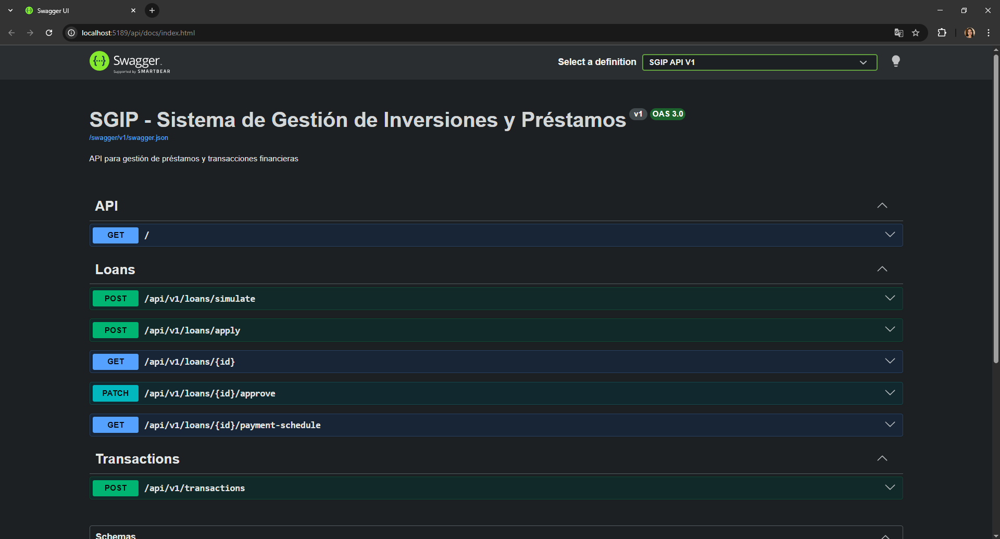
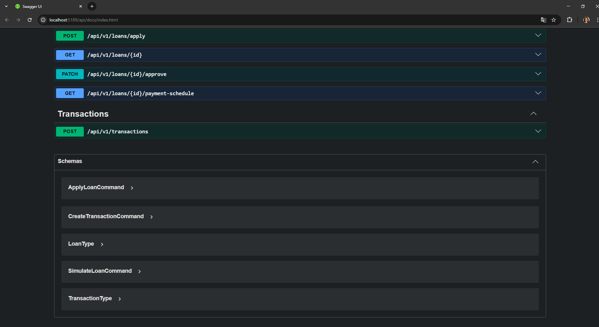

# SGIP Backend

## 1. Descripción del proyecto

Este proyecto implementa el backend de un sistema financiero (SGIP) enfocado en la gestión de préstamos, transacciones y portafolios. El objetivo principal es demostrar el uso de Clean Architecture + Domain Driven Design (DDD), junto con la implementación de patrones de diseño solicitados.

## 2. Inicio rápido

### Pre-requisitos

- .NET 10
- PosgreSQL

### Clonar repositorio

```bash
git clone <repo-url>
cd sgip-backend
```

### Restaurar dependencias

```bash
dotnet restore
```

### Configurar base de datos

1. Crear la base de datos manualmente

```bash
CREATE DATABASE sgip;
```

2. Luego configurar el connection string en appsettings.json

```json
"ConnectionStrings": {
    "DefaultConnection": "Host=localhost;Database=database;Username=username;Password=password"
  }
```

### Ejecutar migraciones

1. Desde la raíz del proyecto:

```bash
dotnet ef migrations add InitialCreate --project src/Infrastructure --startup-project src/API
```

```bash
dotnet ef database update --project src/Infrastructure --startup-project src/API
```

### Levantar el proyecto

```bash
dotnet run --project src/API
```

### Acceder a swagger

```bash
http://localhost:XXXX/api/docs
```

### Correr los tests

```bash
dotnet test src/Tests/Tests.csproj
```

## 3. Arquitectura

El proyecto sigue Clean Architecture con separación en capas:

### Domain

- Contiene reglas de negocio puras
- Entidades: Loan, Transaction
- Value Objects: Money, InterestRate

### Application

- Casos de uso (Handlers)
- Orquestación del dominio

### Infrastructure

- EF Core
- Repositorios
- Configuración de base de datos

### API

- Endpoints REST
- Configuración de dependencias

## 4. Documentación API

```bash
http://localhost:XXXX/api/docs
```

### Endpoints implemementados

#### Loans

```bash
POST /api/v1/loans/simulate
```

Simula un préstamo calculando cuota, tasa efectiva y cronograma.

```bash
POST /api/v1/loans/apply
```

Crea una solicitud de préstamo.

```bash
GET /api/v1/loans/{id}
```

Obtiene la información de un préstamo por ID.

```bash
GET /api/v1/loans/{id}/payment-schedule
```

Obtiene el cronograma de pagos asociado al préstamo.

```bash
PATCH /api/v1/loans/{id}/approve
```

Aprueba un préstamo cambiando su estado.

#### Transactions

```bash
POST /api/v1/transactions
```

Crea una transacción (con soporte de idempotencia).

## 5. Testing
```bash
dotnet test src/Tests/Tests.csproj
```
- Test 1 — Cálculo de tasa efectiva
- Test 2 — Validaciones de préstamo
- Test 3 — Idempotencia de transacciones

## Supuestos y Limitaciones

- No se implementó autenticación
- No se implementaron casos 3 y 4 (dashboard y reconciliación)
- Se priorizaron los casos críticos del negocio (préstamos y transacciones)

## 6. Evidencias

